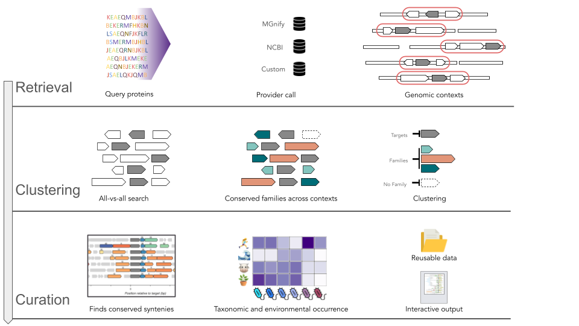

# metaGCsnap

metaGCsnap is an extended version of [GCsnap 2.0](https://github.com/GCsnap/gcsnap2desktop) that supports multiple genomic-context data providers in a single run: **NCBI**, **UniProt**, **MGnify**, and a **local database**. Targets from different providers are merged into a unified genomic-context view, enabling direct comparison of genomic contexts across resources. An overview of metaGCsnap workflow is shown below.




---

## Table of Contents

1. [Installation](#1-installation)
2. [Providers setup](#2-providers-setup)
   - 2.1 [Setting Up the MGnify Database](#21-setting-up-the-mgnify-database)
   - 2.2 [Setting Up a Local Database](#22-setting-up-a-local-database)
3. [Provider-specific config edits](#3-provider-specific-config-edits)
4. [Usage](#4-usage)
5. [Advanced topics](#5-advanced-topics)
6. [Configuration](#6-configuration)
7. [Credits](#7-credits)

---

## 1. Installation

**conda or mamba must be installed before running the install script.**

### 1.1 Clone and create the base environment

```bash
git clone https://github.com/GCsnap/metaGCsnap.git
cd metaGCsnap
bash install_providers.sh --base
conda activate metagcsnap
```

This creates the `gcsnap` conda environment with all core dependencies (Python 3.11, MMseqs2, Biopython, Bokeh, Matplotlib, Networkx, PaCMAP, Scikit-learn, Pandas, Rich, Requests, and more) and registers the `GCsnap` CLI. No data provider is available yet.

### 1.2 Install provider dependencies

Run the script again with the flag for the provider(s) you need:

```bash
bash install_providers.sh --ncbi      # NCBI / UniProt provider
bash install_providers.sh --mgnify    # MGnify metagenomics provider
bash install_providers.sh --local     # local database provider
bash install_providers.sh --complete  # all three providers
```

Providers can be added at any time after the base install. The base environment is preserved and only the provider-specific packages are added.

### 1.3 Configure provider fields

Open `config.yaml` and fill in the paths required by the providers you installed. For a detailed description of the fields, see the config section below:

| Provider | Keys to set |
|----------|-------------|
| NCBI     | `ncbi-user-email`, `ncbi-api-key` |
| MGnify   | `MGnify-path`, `MGnify-proxies` (optional) |
| local    | `gff-path`, `db-path` |

For instructions on how to get the ncbi-api, see https://www.ncbi.nlm.nih.gov/datasets/docs/v2/api/api-keys.
### 1.4 Windows note

MMseqs2 has no Windows conda package. Install without `--local` and download the static binary from https://mmseqs.com/latest/. Pass the path via `--mmseqs-executable-path` when running GCsnap.

---

## 2. Providers setup

To access the data of each repository, you are required to run some setup scripts.

### 2.1 Setting Up the MGnify Database

Before using the MGnify provider, you need to download the relevant MGnify database files.

#### 2.1.1 Choose a version

- `2024_04` — most recent version; best for exhaustive local searches. Matches the [MGnify online phmmer search](https://www.ebi.ac.uk/metagenomics/sequence-search/search/phmmer). Requires considerable storage (~103 GB after conversion).
- `2023_02` — corresponds to the [ESM Atlas](https://esmatlas.com/about). Use this to investigate have a correspondence to protein structures.

#### 2.1.2 Download the raw files

As a concrete example, we will consider the most recent MGnify version, which is 2024_04

```bash
python3 gcsnap/supplementary/MGnify/download.py \
    --MGnify-version 2024_04 \
    --out-dir your/out/dir
```

Both `--MGnify-version` and `--out-dir` are required. Given the limitations of MGnify API we will need to host locally a set of files to match different IDs. This creates `your/out/dir/MGnify_2024_04/` with the relevant data. Separating this step from the conversion step is useful when working on HPC systems with distinct download and compute nodes. This step is sufficient to run metaGCsnap, once the target MGnify IDs are provided. Such IDs can be obtained from the putput of the online phmmer search. For a concrete example, you can see the tutorial.

#### 2.1.3 Convert to Parquet

To speed up ID searches, convert the `.tsv.gz` files to `.parquet`:

```bash
python3 gcsnap/supplementary/MGnify/make_MGnify.py \
    --database your/out/dir/MGnify_2024_04
```

Once the conversion is complete, you can delete the original `.tsv.gz` files to save space. (we will take care of ths aspect later)

#### 2.1.4 Expected database layout

After setup, `your/out/dir/MGnify_2024_04/` should look like:

```
MGnify_2024_04/ (~103 GB)
├── contig_map/           (~32 GB)
│   ├── delimiters.csv
│   └── mgy_contig_map_*.parquet
└── seq_metadata/         (~71 GB)
    ├── delimiters.csv
    └── mgy_seq_metadata_*.parquet
```

The folder structure is the same regardless of the MGnify version used.

---

### 2.2 Setting Up a Local Database

The local provider works with a pre-built SQLite database of assemblies and sequences. Setup scripts are in `gcsnap/supplementary/local/`.

```bash
python3 gcsnap/supplementary/local/db_create_assemblies.py --config config.yaml
```

Set `gff-path` and `db-path` in `config.yaml` to point to your GFF annotation folder and the resulting database, respectively.

---

## 3. Provider-specific config edits

Depending on the installed providers, you will have to specify 

| Provider | Mandatory field | Description |
|----------|----------------|-------------|
| MGnify | `MGnify-path` | Path to your local `MGnify_<version>/` folder |
| MGnify | `MGnify-proxies` | http/s proxies for API calls |
| NCBI | `ncbi-user-email` | Your email address, required by NCBI Entrez |
| NCBI | `ncbi-api-key` | Your NCBI API key — raises rate limit from 3 to 10 req/s |
| local | `gff-path` | Path to your folder of `.gff.gz` annotation files |
| local | `db-path` | Path to your GCsnap SQLite database |

## 4. Usage
GCsnap requires at least one provider target file. Provider flags can be combined freely to run a mixed NCBI + MGnify job.

```bash
GCsnap --ncbi-targets    path/to/ncbi_ids.txt
GCsnap --mgnify-targets  path/to/mgyp_ids.txt
GCsnap --local-targets   path/to/local_ids.txt

# Combined run
GCsnap --ncbi-targets path/to/ncbi_ids.txt --mgnify-targets path/to/mgyp_ids.txt
```

Each target file is a plain-text file with one identifier per line (`#` lines are ignored).

All optional arguments can be set in `config.yaml` or passed directly on the CLI (e.g. `--n-cpu 8`). CLI values take precedence when `overwrite-config: true`.

```bash
GCsnap --help   # full list of arguments and current defaults
```

### 4.1 Resume from a previous run

If a run is interrupted, re-running the same command will automatically skip providers and steps whose output files are already present on disk.

---


## 5. Advanced topics

### 5.1 Taxonomic assignment

By default, metaGCsnap clusters contigs using SourMash (ANI estimation). To enable actual taxonomic assignment, download the GTDB Kraken2 index (requires ~0.5 TB):

```bash
python3 gcsnap/supplementary/MGnify/download.py \
    --MGnify-version 2024_04 \
    --out-dir your/out/dir \
    --taxonomy-db \
    --taxonomy-db-dir your/taxdb/dir
```

To the include taxonomic profiling in metaGCsnap workflow, edit the following configuration flags:

| Provider | Mandatory field | Description |
|----------|----------------|-------------|
| MGnify | `genome-classification` | taxonomy
| MGnify | `kraken-path` | Path to your GTDB Kraken2 index |

The taxonomy and protein search directories can be stored separately. Set `kraken-path` in `config.yaml` to `your/taxdb/dir` to activate Kraken2-based taxonomy.

### 5.2 Local sequence search against MGnify proteins
By default, metaGCsnap identifies MGnify targets by matching MGYP identifiers against the locally hosted Parquet index. For large-scale or custom queries that require searching by sequence rather than by ID, you can build a local MMseqs2 index against the full MGnify protein catalogue.

First, download the protein FASTA (approx. 74 GB for 2024_04) by re-running the download script with the --local-proteins flag:

```bash
python3 gcsnap/supplementary/MGnify/download.py \
    --MGnify-version 2024_04 \
    --out-dir your/out/dir \
    --local-proteins
```

This command will skip the download of already present files. Then submit the provided SLURM script to build the MMseqs2 index (edit resource settings as needed for your cluster):

sbatch gcsnap/supplementary/MGnify/make_mmseqs.sh your/out/dir
This generates an index at your/out/dir/mmseqsDBs/mgyc. For most users the 90% identity cluster representative set is recommended. Note that local sequence search can require up to ~350 GB of RAM.


## 6. Configuration

All options live in `config.yaml`. They can also be overridden on the CLI (e.g. `--n-cpu 8`); set `overwrite-config: true` to make CLI values persist back to the file.

### 6.1 General

Basic run settings that apply regardless of provider.

| Option | Description | Default |
|--------|-------------|---------|
| `out-label` | Output directory name (defaults to input filename) | `default` |
| `n-cpu` | Number of CPU cores | `4` |
| `overwrite-config` | Allow CLI values to overwrite `config.yaml` | `false` |


### 6.2 Genomic context collection

Controls how genomic contexts are retrieved and filtered.

| Option | Description | Default |
|--------|-------------|---------|
| `n-flanking5` | Flanking genes on the 5′ end | `4` |
| `n-flanking3` | Flanking genes on the 3′ end | `4` |
| `exclude-partial` | Exclude partial genomic context blocks | `true` |
| `collect-only` | Stop after context collection, skip comparisons and figures | `false` |

### 6.3 Protein families

Parameters for the MMseqs2 all-against-all search used to define protein families.

| Option | Description | Default |
|--------|-------------|---------|
| `max-evalue` | E-value cutoff for homology | `0.001` |
| `min-coverage` | Minimum alignment coverage for homology | `0.7` |
| `default-base` | Distance assigned to non-homologous sequence pairs | `10` |
| `num-iterations` | Number of all-against-all search iterations | `1` |

### 6.4 Operon clustering

Controls grouping of genomic contexts into operon/synteny types. The advanced mode uses PaCMAP dimensionality reduction and is recommended for large input sets (thousands of sequences).

| Option | Description | Default |
|--------|-------------|---------|
| `operon-cluster-advanced` | Enable advanced PaCMAP-based operon clustering | `false` |
| `max-family-freq` | Max family frequency to include in advanced clustering | `20` |
| `min-family-freq` | Min family frequency to include in advanced clustering | `2` |
| `min-family-freq-accross-contexts` | Min family frequency within a context type to be considered a member | `30` |
| `n-max-operons` | Max number of top-populated operon types to display | `30` |

### 6.5 Output and figures

| Option | Description | Default |
|--------|-------------|---------|
| `interactive` | Generate interactive HTML output | `true` |
| `out-format` | Figure format: `png`, `svg`, or `pdf` | `png` |
| `genomic-context-cmap` | Matplotlib colormap for syntenic blocks | `Spectral` |
| `gc-legend-mode` | Legend mode: `species` or `ncbi_code` | `species` |
| `min-coocc` | Minimum co-occurrence to connect two genes in graphs | `0.3` |
| `sort-mode` | Context sort order: `taxonomy`, `as_input`, `tree`, `operon`, `operon cluster` | `taxonomy` |

### 6.6 NCBI provider

Required when using `--ncbi-targets`. An API key is technically optional but strongly recommended — without it NCBI rate-limits requests to 3/s. Keys can be obtained at https://www.ncbi.nlm.nih.gov/datasets/docs/v2/api/api-keys.

| Option | Description | Default |
|--------|-------------|---------|
| `ncbi-user-email` | Your NCBI-associated email, required by Entrez | — |
| `ncbi-api-key` | Your NCBI API key — raises rate limit from 3 to 10 req/s | — |
| `assemblies-data-update-age` | Days before cached assembly files are re-downloaded | `14` |

### 6.7 MGnify provider

Required when using `--mgnify-targets`. See [Setting Up the MGnify Database](#21-setting-up-the-mgnify-database) for how to populate `MGnify-path`.

| Option | Description | Default |
|--------|-------------|---------|
| `MGnify-path` | Path to your local `MGnify_<version>/` folder | — |
| `MGnify-proxies` | HTTP/S proxies for MGnify API calls (e.g. behind an HPC firewall) | `{}` |
| `genome-classification` | Contig classification method: `binning` or `taxonomy` | `binning` |
| `kraken-path` | Path to GTDB Kraken2 index — required when `genome-classification: taxonomy` | — |

### 6.8 Local provider

Required when using `--local-targets`. See [Setting Up a Local Database](#22-setting-up-a-local-database) for setup instructions.

| Option | Description | Default |
|--------|-------------|---------|
| `gff-path` | Path to folder of `.gff.gz` annotation files | — |
| `db-path` | Path to GCsnap SQLite database | — |

### 6.9 Executables

Only needed if the tools are not available in the conda environment (e.g. loaded as cluster modules). Use `which mmseqs` (or equivalent) to get the correct path.

| Option | Description | Default |
|--------|-------------|---------|
| `mmseqs-executable-path` | Path to MMseqs2 binary | — |
| `foldseek-executable-path` | Path to Foldseek binary | — |
| `sourmash-executable-path` | Path to Sourmash binary | — |
| `tmp-folder` | Temporary folder for intermediate files | `./tmp` |
| `tmp-mmseqs-folder` | Temporary folder for MMseqs2 files specifically (defaults to `tmp-folder`) | — |

---

## 7. Credits

metaGCsnap is built on top of [GCsnap and GCsnap 2.0](https://www.sciencedirect.com/science/article/pii/S0022283621001443). The original desktop and cluster versions can be found at [gcsnap2desktop](https://github.com/GCsnap/gcsnap2desktop) and [gcsnap2cluster](https://github.com/GCsnap/gcsnap2cluster).

If you use metaGCsnap, please cite the original GCsnap paper:

> J. Pereira, GCsnap: interactive snapshots for the comparison of protein-coding genomic contexts, *J. Mol. Biol.* (2021) 166943. https://doi.org/10.1016/j.jmb.2021.166943

metaGCsnap is being developed at the Biozentrum of the University of Basel (Schwede group).
